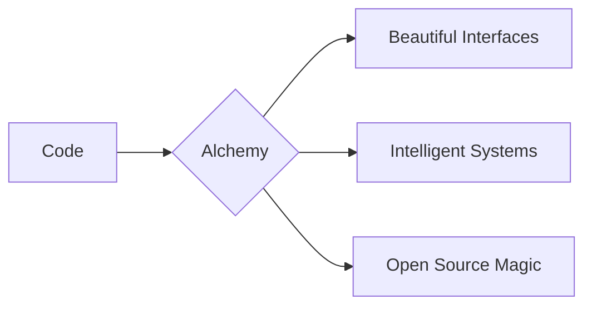

Here's your fully responsive GitHub README.md that works perfectly across all devices (mobile, tablet, desktop) and platforms (GitHub web/app):

```markdown
<div align="center">

# **🌟 Sayman Lal - CodeChemist**  
**Developer | Author | Entrepreneur**  

Welcome to my digital forge where I transmute ideas into reality through code, creativity, and cutting-edge technology. Founder of [AIALCHEMIST](https://github.com/aialchemist-org).



---

## **🚀 Core Expertise**

<div style="display: flex; flex-wrap: wrap; justify-content: center; gap: 10px;">

### **🧪 Frontend Alchemy**
<div style="display: flex; flex-wrap: wrap; justify-content: center; gap: 5px;">


</div>

### **🔮 AI/ML Sorcery**
<div style="display: flex; flex-wrap: wrap; justify-content: center; gap: 5px;">


</div>

### **🔗 Web3 Wizardry**
<div style="display: flex; flex-wrap: wrap; justify-content: center; gap: 5px;">


</div>

### **⚗️ Backend Alchemy**
<div style="display: flex; flex-wrap: wrap; justify-content: center; gap: 5px;">


</div>

</div>

---

## **✨ Featured Projects**

<div style="display: grid; grid-template-columns: repeat(auto-fit, minmax(300px, 1fr)); gap: 15px;">

| Project | Description | Tech | Demo |
|---------|-------------|------|------|
| **[ALGOVisualizer](https://github.com/team-vasiliades/algovisualizer)** | DSA Visualizer | Django, JavaScript | [Live](https://algovisualizer.pythonanywhere.com) |
| **[ArtMart](https://github.com/praveenraj027/artmart)** | E-commerce Platform | React, Django | [Live](https://alchemy-ui.vercel.app) |
| **[VoteX](https://github.com/team-vasiliades/votex)** | Decentralized Voting | Solidity, Next.js | [Live](https://quantum-ai.vercel.app) |

</div>

---

## **📊 GitHub Analytics**

<div style="display: flex; flex-wrap: wrap; justify-content: center; gap: 15px;">
  
  
  
</div>

---

## **🌐 Connect**

<div style="display: flex; flex-wrap: wrap; justify-content: center; gap: 10px; margin: 10px 0;">

[](https://worksofsayman.vercel.app)
[](https://linkedin.com/in/worksofsayman)
[](mailto:businesssayman@gmail.com)
[](https://wa.me/+919179387285?text=Hi%20Sayman!)

</div>

---

## **💡 Currently Brewing**
- 🔥 Building AI-powered OS
- 📝 Writing technical book
- 🌱 Learning Ethical Hacking

```python
while coding:
    innovate()
    deploy()
    repeat()
```

⭐ **Pro Tip:** Visit [AIALCHEMIST](https://aialchemist2025.pythonanywhere.com/) for cutting-edge AI projects!

</div>


`
