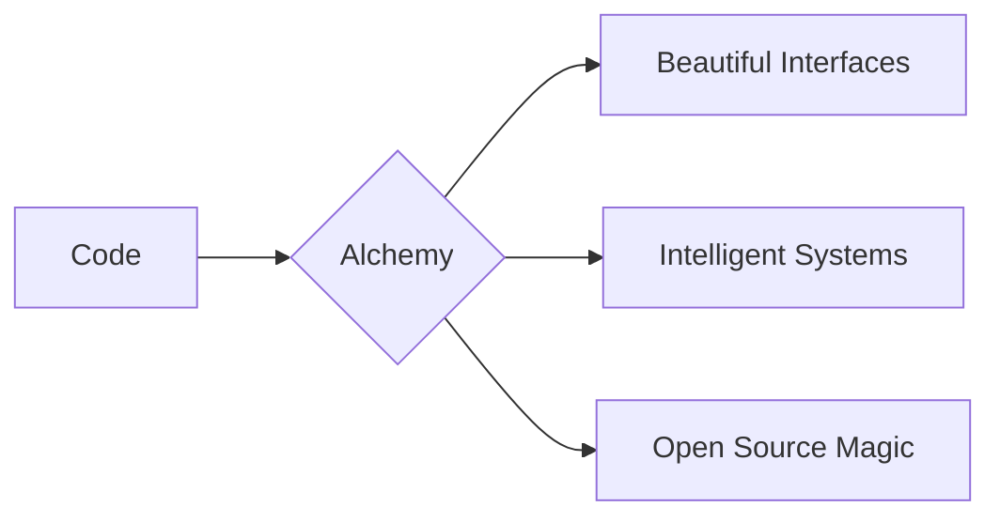

# **🌟 Sayman Lal - CodeChemist**  
**Developer | Author | Entrepreneur**  

Welcome to my digital forge where I transmute ideas into reality through code, creativity, and cutting-edge technology. Founder of [AIALCHEMIST](https://github.com/aialchemist-org), crafting intelligent solutions at the intersection of AI and web development.



---

## **🚀 Core Expertise**
### **🧪 Frontend Alchemy**


### **🔮 AI/ML Sorcery**


### **⚗️ Backend Potions**


### **🧰 Dev Tools**


---

## **✨ Featured Creations**
| Project | Description | Tech Stack | Live Demo |
|---------|-------------|------------|----------|
| **[ALGOVisualizer](https://github.com/worksofsayman/algovisualizer)** | DSA Visualizer | Django, HTML5/CSS/Vanilla Javascript, REST API | [Demo](https://algovisualizer.pythonanywhere.com) |
| **[Alchemy UI](https://github.com/worksofsayman/alchemy-ui)** | Component Library for Modern Web | React, TypeScript, Storybook | [Storybook](https://alchemy-ui.vercel.app) |
| **[Quantum](https://github.com/worksofsayman/quantum)** | AI-Powered Code Generator | Python, GPT-3, Next.js | [Try It](https://quantum-ai.vercel.app) |

---

## **📊 GitHub Analytics**
<div align="center">
  
  
  
</div>

---

## **🏆 Achievements**
- 🥈 **1st Runner Up** at Genethon 2024 (Team Lead)
- 🎤 **UiPath GGITS Introduction Session** Speaker (2025)
- 🏅 **5+ Open Source Contributions** to major projects
- 📚 Published **1 Poetry book** on love

---

## **🌐 Connect With Me**
[](https://worksofsayman.vercel.app)
[](https://linkedin.com/in/worksofsayman)
[](https://twitter.com/worksofsayman)
[](mailto:businesssayman@gmail.com)

---

## **💡 Currently Brewing**
- 🔥 Building an AI-powered **developer toolkit**
- 📝 Writing a **technical book** on modern web development
- 🌱 Learning **Rust** and **WebAssembly**

```python
# My current coding ritual
while True:
    code()
    debug()
    coffee.refill()
    if idea.brilliant():
        implement()
```

---

⭐ **Pro Tip:** Check out my [AIALCHEMIST](https://aialchemist2025.pythonanywhere.com/) organization for cutting-edge AI projects!

---


